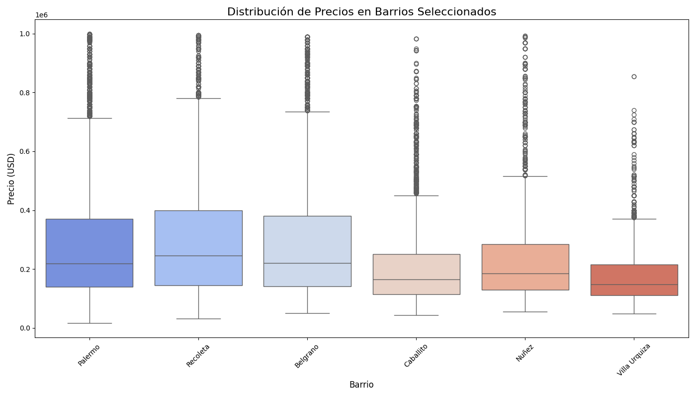

# 📊 **Análisis de Inversión y Oportunidades de Mercado**

Esta sección presenta un análisis profundo del mercado inmobiliario de CABA, utilizando visualizaciones para extraer insights accionables y demostrar el valor del dataset. El objetivo es responder preguntas clave para un inversor o analista.

## 💎 **Análisis de "Joyas Ocultas": ¿Dónde está el Valor Escondido?**

Un inversor inteligente no solo busca el barrio más caro, sino el que tiene mayor potencial de revalorización. El siguiente gráfico cruza el precio por metro cuadrado (`precio/m²`) con un score de amenities, que representa la cantidad promedio de comodidades (pileta, gimnasio, etc.) en las propiedades de la zona.


**Interpretación:** Barrios como **Villa Crespo y Chacarita** se destacan como "Joyas Ocultas". Ofrecen un score de amenities competitivo, similar al de zonas más caras, pero a un precio por metro cuadrado considerablemente menor. Esto sugiere un alto potencial de valorización a medida que estos barrios continúan su desarrollo.

---

## 📈 **Análisis de Dispersión de Mercado: Volatilidad y Oportunidad**

El precio promedio no cuenta toda la historia. Un box plot nos permite visualizar la distribución de precios, la mediana y los valores atípicos, revelando la verdadera naturaleza de cada mercado local en los 6 barrios con mayor cantidad de propiedades.



**Interpretación:**
*   **Mercados Heterogéneos (Cajas Altas):** **Palermo y Recoleta** tienen un rango de precios muy amplio, indicando una gran variedad en la oferta y una mayor probabilidad de encontrar propiedades a precios competitivos.
*   **Mercados Homogéneos (Cajas Cortas):** **Caballito y Belgrano** muestran precios más consistentes y predecibles, representando mercados más estables.

---

## 🚀 **Cómo Generar este Análisis**

Este análisis fue generado por el notebook `notebooks/analisis_de_inversion.ipynb`. Este cuaderno se conecta directamente a la base de datos para realizar el análisis y guardar los gráficos.

Para ejecutarlo y regenerar las imágenes, asegúrate de tener la base de datos corriendo y luego ejecuta desde la raíz del proyecto:

```bash
jupyter nbconvert --to notebook --execute notebooks/analisis_de_inversion.ipynb
```
