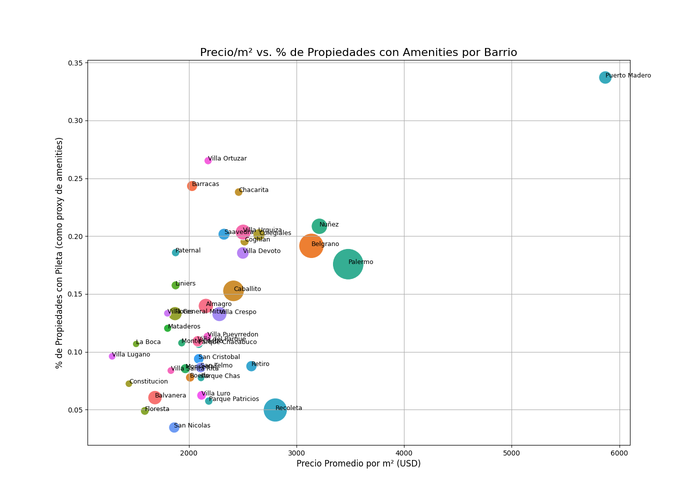

# 📊 **Análisis de Inversión y Oportunidades de Mercado**

Esta sección presenta un análisis profundo del mercado inmobiliario de CABA, utilizando visualizaciones para extraer insights accionables y demostrar el valor del dataset. El objetivo es responder preguntas clave para un inversor o analista.

## 💎 **Análisis de "Joyas Ocultas": ¿Dónde está el Valor Escondido?**

Un inversor inteligente no solo busca el barrio más caro, sino el que tiene mayor potencial de revalorización. Una forma de medir esto es encontrar zonas donde el precio por metro cuadrado (`precio/m²`) aún no es prohibitivo, pero la calidad de la oferta (medida por la cantidad de `amenities`) es alta.

El siguiente gráfico cruza estas dos variables:

*   **Eje X:** Precio Promedio por m² (más a la derecha, más caro).
*   **Eje Y:** % de Propiedades con Amenities (más arriba, mejor oferta).
*   **Tamaño de la Burbuja:** Cantidad de propiedades en el barrio (más grande, más mercado).



### **Interpretación y Conclusiones de Inversión:**

1.  **Lujo Consolidado (Cuadrante Superior Derecho):** **Puerto Madero, Palermo y Recoleta** son los líderes indiscutibles. Tienen el precio/m² más alto y una gran oferta de amenities. Son inversiones seguras y de prestigio, pero con una barrera de entrada muy alta y, posiblemente, menor margen de crecimiento porcentual.

2.  **Las "Joyas Ocultas" (Cuadrante Superior Izquierdo):** Aquí es donde encontramos el valor. Barrios como **Villa Crespo, Chacarita y Colegiales** tienen un porcentaje de amenities comparable al de zonas más caras, pero su precio/m² es significativamente más bajo. 
    *   **Insight Clave:** Estos barrios están en pleno proceso de "palermización" y gentrificación. Comprar aquí podría significar una alta revalorización a mediano plazo a medida que sus precios convergen con los de sus vecinos más cotizados.

3.  **Mercados Tradicionales (Cuadrante Inferior Izquierdo):** Zonas como **Almagro, Caballito o Villa Urquiza** representan un mercado más tradicional. Tienen una gran cantidad de propiedades (burbujas grandes) y precios por m² más accesibles, pero una menor proporción de edificios con amenities modernos. Son ideales para una inversión conservadora o para compradores finales que buscan una buena relación precio/ubicación sin tanto lujo.

4.  **Zonas Emergentes (Cerca del Origen):** Barrios con bajo precio/m² y baja oferta de amenities. Podrían ser apuestas a muy largo plazo, pero con mayor riesgo.

---

## 🚀 **Cómo Generar este Análisis**

Este análisis fue generado por el notebook `notebooks/analisis_de_inversion.ipynb`. Este cuaderno se conecta directamente a la base de datos para realizar el análisis y guardar los gráficos.

Para ejecutarlo y regenerar las imágenes, asegúrate de tener la base de datos corriendo y luego ejecuta desde la raíz del proyecto:

```bash
jupyter nbconvert --to notebook --execute notebooks/analisis_de_inversion.ipynb
```
