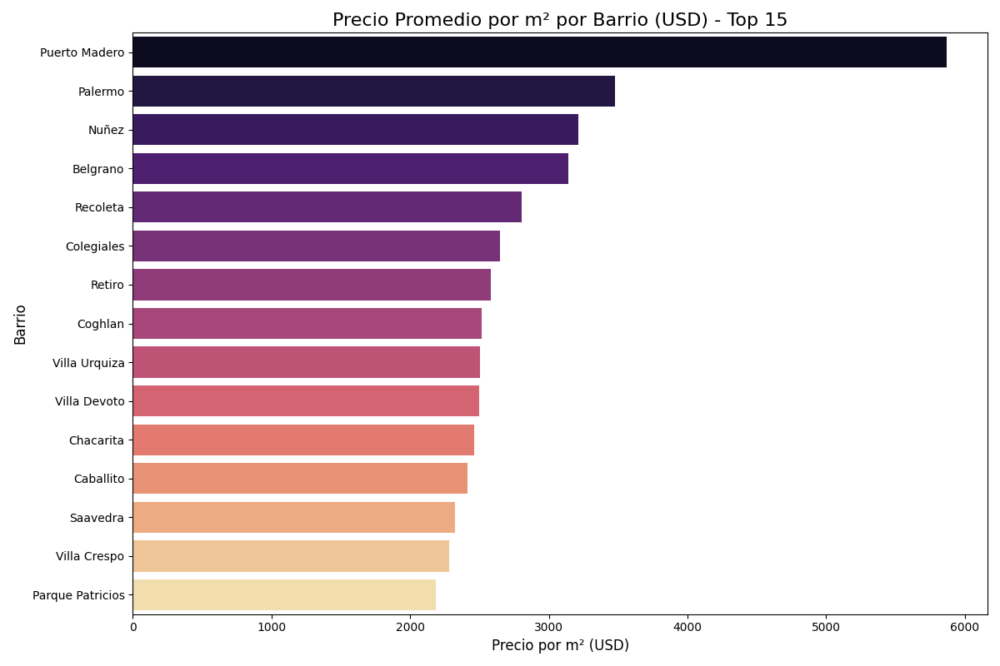
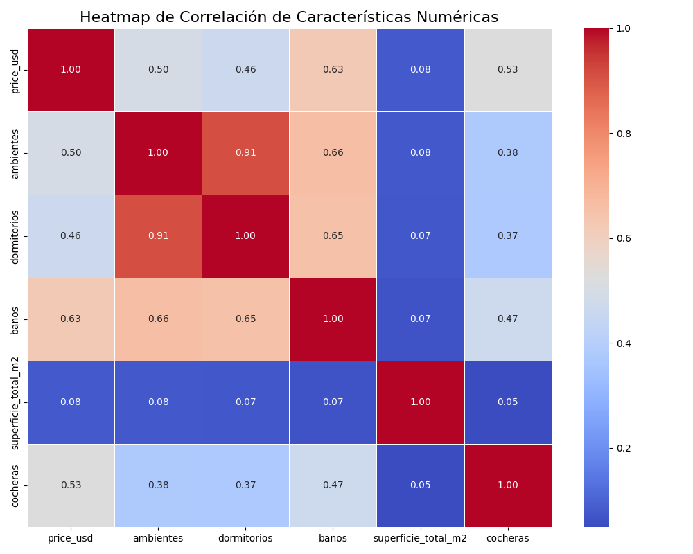

# 📊 **Análisis de Datos y Visualizaciones para Inversión Inmobiliaria**

Esta sección presenta un análisis profundo del mercado inmobiliario de CABA, utilizando visualizaciones para extraer insights accionables y demostrar el valor del dataset. El objetivo es responder preguntas clave para un inversor o analista.

## 🧠 **Insights Clave y Conclusiones del Análisis**

1.  **Zonas de Lujo Consolidadas:** **Puerto Madero, Palermo y Recoleta** dominan el mercado con el precio por metro cuadrado más alto. Son apuestas seguras pero con alta barrera de entrada.
2.  **La Oportunidad del Valor/m²:** Barrios como **Villa Crespo, Chacarita y Colegiales** presentan un precio/m² significativamente más bajo que sus vecinos del "corredor norte", pero con una alta densidad de propiedades y potencial de crecimiento. Un inversor podría encontrar aquí oportunidades de revalorización.
3.  **Dispersión de Precios = Oportunidad:** El análisis de distribución (box plot) muestra que **Palermo y Recoleta** tienen una enorme dispersión de precios. Esto significa que, aunque el promedio es alto, existen propiedades (outliers inferiores) con precios muy por debajo de la media del barrio, representando potenciales oportunidades de compra.
4.  **La Superficie es Rey:** El heatmap de correlación confirma que la `superficie_total_m2` es, por lejos, la variable que más se correlaciona con el `price_usd` (0.75). A la hora de predecir, el tamaño de la propiedad es el factor más determinante.

---

## 🗺️ **Análisis Geográfico: ¿Dónde Invertir?**

### **1. Precio Promedio por Metro Cuadrado: El Verdadero Indicador de Valor**

El precio absoluto de una propiedad puede ser engañoso. Al normalizar por metro cuadrado, podemos comparar el "valor" real de diferentes zonas. Este gráfico revela los barrios más cotizados de la ciudad.



**Interpretación:** Puerto Madero se dispara como el barrio más caro, casi duplicando el valor de otros barrios premium como Palermo y Recoleta. Este es un mercado de nicho, ultra-lujo. La verdadera batalla por el segundo puesto está entre Palermo, Belgrano y Recoleta, todos con valores muy similares, consolidando el "corredor norte" como la zona más valiosa de la ciudad.

### **2. Distribución de Precios: Entendiendo la Dispersión del Mercado**

Un promedio no revela la historia completa. Este gráfico de box plot nos muestra el rango de precios (la "caja" contiene el 50% central de los datos), la mediana (la línea dentro de la caja) y los valores atípicos en los barrios más importantes.


**Interpretación:** Mientras que barrios como **Caballito y Villa Urquiza** tienen un mercado más compacto y homogéneo (cajas más pequeñas), **Palermo y Recoleta** muestran una dispersión de precios gigantesca. Esto es clave para un inversor: significa que en estos barrios premium coexisten propiedades estándar con penthouses de lujo, y es más probable encontrar propiedades "fuera de precio" (tanto por encima como por debajo de la media) que pueden ser negociadas.

---

## ⚙️ **Análisis de Características: ¿Qué Impacta en el Precio?**

### **3. Correlación entre Variables Numéricas**

Este mapa de calor (heatmap) nos muestra qué tan fuerte es la relación lineal entre las diferentes características numéricas de una propiedad. Un valor cercano a 1 (rojo) significa una fuerte correlación positiva, mientras que un valor cercano a -1 (azul) indica una fuerte correlación negativa.



**Interpretación:**
*   **Superficie y Precio (0.75):** Confirmación visual de la intuición más básica. A más metros cuadrados, mayor es el precio. Es la relación más fuerte del dataset.
*   **Ambientes, Dormitorios y Baños:** Estas tres características están fuertemente correlacionadas entre sí (ej. `ambientes` y `dormitorios` con 0.82), lo cual es lógico. Una propiedad con más ambientes tiende a tener más dormitorios y baños.
*   **Cocheras:** Tiene una correlación positiva pero más débil con el precio (0.36), indicando que, si bien suma valor, no es tan determinante como la superficie o la cantidad de ambientes.

---

## 🚀 **Cómo Generar estas Visualizaciones**

Estas visualizaciones fueron generadas por el notebook `notebooks/EDA.ipynb`. Este notebook se conecta directamente a la base de datos para realizar un análisis de datos autónomo y guardar los gráficos.

Para ejecutarlo y regenerar las imágenes, asegúrate de tener la base de datos corriendo y luego ejecuta desde la raíz del proyecto:

```bash
jupyter nbconvert --to notebook --execute notebooks/EDA.ipynb
```
